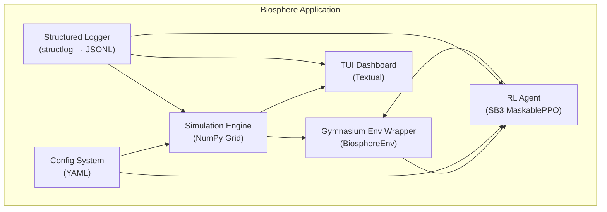

> **BLUF:** A real-time 2D ecological simulation with a Reinforcement Learning "Caretaker" agent that maintains biodiversity via weather, resource, and population interventions. Built on a custom NumPy simulation engine, Gymnasium/Stable-Baselines3 PPO RL stack, and a Textual TUI dashboard. Cross-platform (Windows/Linux). Designed to showcase Agentic Architect capabilities.

# The Biosphere Ecological Balancer

> **"A world model where an AI learns to play God — and we grade its performance with math."**

---

## 1. Problem Statement & Success Criteria

**Core Objective:** Build a CLI-based world model where a trained RL agent ("Caretaker") actively intervenes in a 2D ecological simulation to maintain maximum species biodiversity, measured by Shannon entropy.

### 1.1 Primary Technical Challenges

| # | Challenge | Complexity Driver |
|:--|:----------|:------------------|
| 1 | **Real-time Simulation** | Complex ecological interactions at ≥1000 steps/sec on 50×50 grid |
| 2 | **RL Stability** | Chaotic dynamics with delayed rewards make policy convergence hard |
| 3 | **Cross-Platform TUI** | Flicker-free, 30+ FPS terminal visualization on Windows and Linux |
| 4 | **Governance Compliance** | Full GOV-002 through GOV-006 compliance from day one |

### 1.2 Quantitative Success Criteria

| Metric | Target | Measurement |
|:-------|:-------|:------------|
| Simulation throughput | ≥1000 steps/sec (50×50) | `pytest-benchmark` |
| RL convergence | Shannon entropy ≥1.5 sustained for 1000+ steps | Training logs |
| TUI frame rate | ≥30 FPS, zero flicker | Frame timing instrumentation |
| Peak memory | ≤500MB (100×100 grid, 1000-step history) | `tracemalloc` |
| Test coverage | ≥80% line, ≥75% branch (GOV-002 §20) | `pytest-cov` |

---

## 2. Prior Art & Research Foundations

> [!IMPORTANT]
> BioGym (NTNU, 2023) is the closest prior art: a Gymnasium-wrapped tri-trophic RL environment for wildlife management. Our design improves on BioGym by adding spatial weather dynamics, a real-time TUI, and NASA-grade governance compliance.

### 2.1 Academic Foundations

| Model | Application | Reference |
|:------|:-----------|:----------|
| **Lotka-Volterra** (modified) | Predator-prey population dynamics | Lotka (1925), Volterra (1926) |
| **Holling Type II/III** | Functional response / resource consumption | Holling (1959) |
| **Shannon-Wiener Index** | Biodiversity entropy measurement | Shannon (1948) |
| **Lévy Flight** | Organism foraging/movement patterns | Viswanathan et al. (1999) |
| **Logistic Growth** | Resource regeneration (`dP/dt = rP(1-P/K)`) | Verhulst (1838) |

### 2.2 Technical Prior Art

| Project | Relevance | Differentiator |
|:--------|:----------|:---------------|
| **BioGym** (NTNU) | Tri-trophic RL environment, Gymnasium wrapper, SB3-compatible | No TUI, no spatial weather, no governance |
| **Aquarium** (MARL) | Multi-agent predator-prey emergent behavior | Multi-agent focus, not ecosystem caretaker |
| **NetLogo / Mesa** | Agent-based modeling platforms | Too heavy, not RL-native |
| **CleanRL** | Single-file RL implementations | Good reference, but SB3 is more production-grade |

### 2.3 Key Research Insights

1. **PPO is proven for ecological RL** — BioGym found PPO produced "stable and consistent improvements" over DQN/A2C for tri-trophic management.
2. **MaskablePPO for invalid actions** — `sb3-contrib` provides `MaskablePPO` which is superior to negative-reward penalties for handling invalid actions (e.g., culling extinct species).
3. **Reward shaping is critical** — Ecological rewards are sparse and delayed. Entropy-regularized RL and intermediate shaping signals (population stability, intervention cost) accelerate convergence.
4. **Textual targets 60 FPS baseline** — The Textual framework uses a compositor + spatial map architecture that enables flicker-free partial updates, far superior to raw `curses` for cross-platform compatibility.

---

## 3. System Architecture

### 3.1 Component Overview



### 3.2 Module Layout

```
biosphere/
├── core/
│   ├── simulation.py      # Grid engine, update cycle
│   ├── species.py          # Species definitions, interaction dynamics
│   └── weather.py          # Weather system, diffusion
├── rl/
│   ├── environment.py      # Gymnasium BiosphereEnv
│   ├── reward.py           # Reward function (Shannon entropy + shaping)
│   └── train.py            # SB3 PPO training script
├── ui/
│   ├── app.py              # Textual App entry point
│   ├── grid_widget.py      # Grid renderer widget
│   ├── charts_widget.py    # Population bar charts
│   └── metrics_widget.py   # RL Q-values, entropy, reward feed
├── logging_config.py       # GOV-006 structlog setup
├── errors.py               # GOV-004 ApplicationError + ErrorContext
├── __main__.py             # CLI entry point
config/
├── simulation.yaml         # All tunable parameters
├── training.yaml           # RL hyperparameters
tests/
├── unit/                   # GOV-002 §4
├── property/               # GOV-002 §5 (Hypothesis)
├── integration/            # GOV-002 §8
├── performance/            # GOV-002 §13
└── conftest.py
```

---

## 4. Core Simulation Engine

### 4.1 Grid Representation

```python
# Core state tensor — all updates are vectorized NumPy operations
grid_state: dict[str, np.ndarray] = {
    "terrain": np.ndarray,      # shape: (H, W, 3) → [elevation, temperature, humidity]
    "organisms": np.ndarray,    # shape: (H, W, MAX_PER_CELL, 4) → [species_id, health, age, energy]
    "resources": np.ndarray,    # shape: (H, W, 2) → [plant_biomass, water_availability]
    "weather": np.ndarray,      # shape: (H, W, 2) → [precipitation, sunlight]
}
```

### 4.2 Update Cycle (Per Step)

| Order | Phase | Model | Complexity |
|:------|:------|:------|:-----------|
| 1 | Weather diffusion | Gaussian blur (scipy.ndimage) | O(H×W) |
| 2 | Resource growth | Logistic: `dP/dt = rP(1-P/K)` | O(H×W) |
| 3 | Organism movement | Lévy flight + resource bias | O(N_organisms) |
| 4 | Consumption | Holling Type II: `aN/(1+ahN)` | O(N_organisms) |
| 5 | Reproduction | Sigmoid: `p = 1/(1+exp(-k(E-θ)))` | O(N_organisms) |
| 6 | Mortality | Exponential: `μ = μ₀·exp(age/λ)` | O(N_organisms) |

### 4.3 Performance Strategy

- **Vectorized NumPy** for all grid-level operations (no Python loops over cells)
- **Dirty rectangle tracking** — only recompute changed spatial regions
- **Object pooling** — pre-allocated organism arrays, no per-step allocation
- **Optional Numba JIT** — `@njit(parallel=True)` for organism movement kernel (10–100x speedup)

---

## 5. RL Environment (Gymnasium)

### 5.1 Observation & Action Spaces

```python
class BiosphereEnv(gymnasium.Env):
    observation_space = gymnasium.spaces.Dict({
        "grid_summary": gymnasium.spaces.Box(0, 255, shape=(H, W, 4)),  # Dominant species + resource density
        "population_stats": gymnasium.spaces.Box(0, 1e4, shape=(N_SPECIES, 3)),  # [count, mean_energy, mean_age]
        "entropy_history": gymnasium.spaces.Box(0, 3.0, shape=(HISTORY_LEN,)),
        "weather_state": gymnasium.spaces.Box(0, 1, shape=(4,)),
    })

    # MultiDiscrete for SB3 MaskablePPO compatibility
    action_space = gymnasium.spaces.MultiDiscrete([
        4,   # action_type: NO_OP, WEATHER, RESOURCE, CULL
        5,   # param_1: intensity / resource_type / species_id
        5,   # param_2: duration / quantity / radius
        5,   # param_3: location_region (discretized grid quadrant)
    ])
```

### 5.2 Reward Function (Multi-Objective)

```python
def calculate_reward(self) -> float:
    populations = self.get_species_populations()
    total = sum(populations)

    # Primary: Shannon entropy (biodiversity)
    proportions = [c / total for c in populations if total > 0]
    entropy = -sum(p * math.log2(p) for p in proportions if p > 0)

    # Penalty: extinction risk (population below critical threshold)
    extinction_penalty = sum(
        max(0, CRITICAL_THRESHOLD - c) for c in populations
    )

    # Penalty: intervention cost (encourage minimal action)
    intervention_cost = COST_WEIGHT * self.last_action_magnitude

    # Bonus: population stability (low variance over recent window)
    stability_bonus = -abs(self.rolling_variance - TARGET_VARIANCE)

    return (
        ENTROPY_WEIGHT * entropy
        - EXTINCTION_WEIGHT * extinction_penalty
        - intervention_cost
        + STABILITY_WEIGHT * stability_bonus
    )
```

### 5.3 Algorithm Choice: SB3 MaskablePPO

| Factor | Decision |
|:-------|:---------|
| **Algorithm** | PPO via `sb3-contrib.MaskablePPO` |
| **Why PPO** | Proven stable for ecological RL (BioGym, 2023). Handles continuous + discrete hybrid spaces. |
| **Why Maskable** | Invalid actions (e.g., culling extinct species) handled natively via action masks instead of negative rewards, preventing "strange behaviors" during training. |
| **Policy** | `MultiInputPolicy` for Dict observation space |
| **Framework** | Stable-Baselines3 (production-grade, well-tested, `gymnasium` native) |

### 5.4 Training Hyperparameters

```yaml
# config/training.yaml
total_timesteps: 1_000_000
learning_rate: 3.0e-4
n_steps: 2048
batch_size: 64
n_epochs: 10
gamma: 0.99
gae_lambda: 0.95
clip_range: 0.2
ent_coef: 0.01        # Encourage exploration
vf_coef: 0.5
max_grad_norm: 0.5
target_kl: 0.03        # Early stopping per epoch
```

---

## 6. CLI Visualization (Textual TUI)

### 6.1 Technology Decision

| Library | FPS | Cross-Platform | Dependencies | Decision |
|:--------|:----|:---------------|:-------------|:---------|
| `curses` | 60+ | ❌ Needs `windows-curses` | 0 | Rejected: poor Windows support |
| **Textual** | 60 baseline | ✅ Native | ~15 | **Selected**: compositor, spatial map, async |
| Rich | 15-20 | ✅ | ~5 | Rejected: no widget system for layout |

### 6.2 Dashboard Layout

```
┌─────────────────────────────┬──────────────────────┐
│                             │  Population Charts   │
│     Biosphere Grid          │  (bar charts per     │
│     (emoji/color cells)     │   species over time) │
│                             │                      │
├─────────────────────────────┼──────────────────────┤
│  RL Agent Actions Feed      │  Metrics Panel       │
│  [WEATHER] Rain +1.5x       │  Step: 12,450        │
│  [CULL] Predator 10% r=3    │  Entropy: 1.47       │
│  [NO_OP]                    │  Reward: +0.34       │
│  [RESOURCE] Water +20 Q3    │  Episode: 4          │
└─────────────────────────────┴──────────────────────┘
```

### 6.3 Rendering Architecture

```
Simulation Thread → asyncio Queue → Textual App (compositor) → Terminal
     (unbounded)      (thread-safe)      (30 Hz cap)           (partial updates)
```

- **Partial updates** via Textual's compositor — only changed widgets re-render
- **Spatial map** ensures only visible widgets are composed
- **30 Hz display cap** regardless of simulation speed (configurable)

---

## 7. Ecological Model

### 7.1 Species Configuration

```yaml
# config/simulation.yaml → species section
predator:
  metabolic_rate: 0.05
  reproduction_threshold: 0.8
  movement_speed_cells: 2.0
  consumption_efficiency: 0.7
  vision_range_cells: 5
  prey_preference: { prey: 1.0, plant: 0.1 }

prey:
  metabolic_rate: 0.02
  reproduction_threshold: 0.6
  movement_speed_cells: 1.5
  consumption_efficiency: 0.8
  vision_range_cells: 3
  food_preference: { plant: 1.0 }

plant:
  growth_rate: 0.1
  max_biomass: 1.0
  spread_probability: 0.01
  sunlight_efficiency: 0.8
  water_requirement: 0.3
```

### 7.2 Interaction Dynamics

| Interaction | Model | Equation |
|:-----------|:------|:---------|
| Predator-Prey | Modified Lotka-Volterra | `dP/dt = αPN - δP; dN/dt = βN - γPN` |
| Resource Consumption | Holling Type II | `C = aN/(1 + ahN)` |
| Spatial Competition | Gause's Exclusion | Max occupancy per cell per species |

### 7.3 Weather Effects

| Weather | Plant Growth | Water | Hunting | Movement |
|:--------|:------------|:------|:--------|:---------|
| Drought | ×0.3 | Evap ×2.0 | — | — |
| Rain | ×1.5 | Evap ×0.5 | Efficiency ×0.8 | — |
| Heatwave | — | Req ×1.5 | — | Speed ×0.7 |

---

## 8. Governance Compliance Matrix

> [!IMPORTANT]
> This section maps every applicable governance requirement to a concrete implementation decision. This is the formal compliance contract.

### 8.1 GOV-001 Documentation Standard

| Requirement | Status | Implementation |
|:-----------|:-------|:---------------|
| YAML frontmatter (11 fields) | ✅ | This document |
| BLUF blockquote | ✅ | Present |
| File ≤30KB | ✅ | Split from research if needed |
| MANIFEST.yaml entry | ⬜ | Add on APPROVED |
| Bidirectional `related` links | ✅ | Links to all GOV docs |

### 8.2 GOV-002 Testing Protocol

| Tier | Applicable | Plan |
|:-----|:----------|:-----|
| 1. Static Analysis | ✅ | Ruff `--select ALL`, MyPy `--strict`, Bandit |
| 2. Unit Tests | ✅ | `tests/unit/` — grid update, reward calc, action execution |
| 3. Property-Based | ✅ | Hypothesis — energy conservation, population bounds, entropy range |
| 4. Snapshot Tests | ✅ | Grid state serialization snapshots |
| 5. Integration | ✅ | Simulation ↔ RL env ↔ TUI pipeline |
| 6. Performance | ✅ | `pytest-benchmark` — steps/sec, FPS, memory |
| 7. E2E | ✅ | Full training run → checkpoint → inference |
| Assertion density | ✅ | ≥2 per test function |
| Traceability | ✅ | `Refs: BLU-001` in docstrings |
| Forensic artifacts | ✅ | `tests/artifacts/master_report.md` generated |

### 8.3 GOV-003 Coding Standard

| Rule | Enforcement |
|:-----|:-----------|
| 30-second rule | Google-style docstrings on all public functions |
| Max 60 lines/function | Ruff `PLR0915` |
| Cyclomatic complexity ≤10 | Radon |
| No magic numbers | Named constants in `config/simulation.yaml` |
| Type hints 100% | MyPy `--strict` |
| Guard clauses first | Code review checklist |
| No dead/commented-out code | Vulture scanner |

### 8.4 GOV-004 Error Handling

| Requirement | Implementation |
|:-----------|:---------------|
| `ApplicationError` base class | `biosphere/errors.py` |
| Error taxonomy | VALIDATION, CONFIGURATION, RESOURCE, INFRASTRUCTURE |
| Global exception handler | `sys.excepthook` in `__main__.py` |
| Crash artifacts | JSONL to `logs/crashes/` |
| Correlation IDs | `contextvars` per GOV-004 §8 |
| FMEA | Required before first deployment |

### 8.5 GOV-005 Agentic Lifecycle

| Phase | Artifact |
|:------|:---------|
| Conversation | This conversation thread |
| Specification | This document (BLU-001) |
| Sprint | Branch: `feat/BLU-001-biosphere` |
| Verification | GOV-002 test suite |
| Merge | Architect approval required |

### 8.6 GOV-006 Logging Specification

| Requirement | Implementation |
|:-----------|:---------------|
| Structured logging (structlog) | `biosphere/logging_config.py` |
| Log destination | JSONL flat file (`logs/biosphere_{date}.log`) |
| TRACE instrumentation | `@trace_execution` on simulation step, RL action, render |
| No `print()` | Ruff scanner, CI gate |
| Correlation IDs | Integrated from GOV-004 |
| Post-test log audit | `conftest.py` auto-fixture per GOV-006 §14 |

---

## 9. Dependencies

```txt
# Core Simulation
numpy>=1.24,<2.0
pyyaml>=6.0

# RL Framework
gymnasium>=0.29
stable-baselines3>=2.0
sb3-contrib>=2.0        # MaskablePPO
torch>=2.0              # SB3 backend

# Visualization
textual>=0.40           # TUI framework (includes Rich)

# Logging & Error Handling
structlog>=23.0

# Development & Testing
pytest>=7.4
pytest-benchmark>=4.0
pytest-cov>=4.1
hypothesis>=6.80        # Property-based testing
mypy>=1.5
ruff>=0.1
```

---

## 10. Risk Register

| # | Risk | Severity | Mitigation |
|:--|:-----|:---------|:-----------|
| 1 | RL trains degenerate policy (cull everything) | HIGH | MaskablePPO action masks + reward shaping + early stopping on entropy collapse |
| 2 | Simulation too slow for real-time TUI | MEDIUM | Numba JIT fallback, configurable quality presets, async decoupling |
| 3 | Textual compatibility edge cases | LOW | Feature detection, Rich-only fallback mode |
| 4 | Numerical instability in ecological ODEs | MEDIUM | Double precision, per-step sanity checks, pathological state resets |
| 5 | SB3 Dict observation space issues | LOW | `MultiInputPolicy` + `check_env()` validation |

---

## 11. Open Questions

1. Optimal grid size ratio: training (small/fast) vs. demo (large/visual)?
2. Should the TUI support "replay mode" from a saved training session?
3. Number of species: start with 3 (predator/prey/plant) or 4+ for richer dynamics?
4. Should weather effects be global or spatially localized with diffusion gradients?

---

## 12. References

1. Lotka, A.J. (1925). *Elements of Physical Biology*.
2. Volterra, V. (1926). *Fluctuations in the Abundance of a Species*.
3. Holling, C.S. (1959). *The Components of Predation*.
4. Shannon, C.E. (1948). *A Mathematical Theory of Communication*.
5. Viswanathan, G.M. et al. (1999). *Optimizing the Success of Random Searches*. Nature.
6. **BioGym**: NTNU (2023). Deep RL for Spatio-Temporal Wildlife Management. [GitHub](https://github.com)
7. Stable-Baselines3 Documentation: [https://stable-baselines3.readthedocs.io](https://stable-baselines3.readthedocs.io)
8. Gymnasium Documentation: [https://gymnasium.farama.org](https://gymnasium.farama.org)
9. Textual Documentation: [https://textual.textualize.io](https://textual.textualize.io)
10. RL for Conservation: *Nature Scientific Reports* (2021). [DOI:10.1038/s41598-021-81776-6](https://doi.org/10.1038/s41598-021-81776-6)