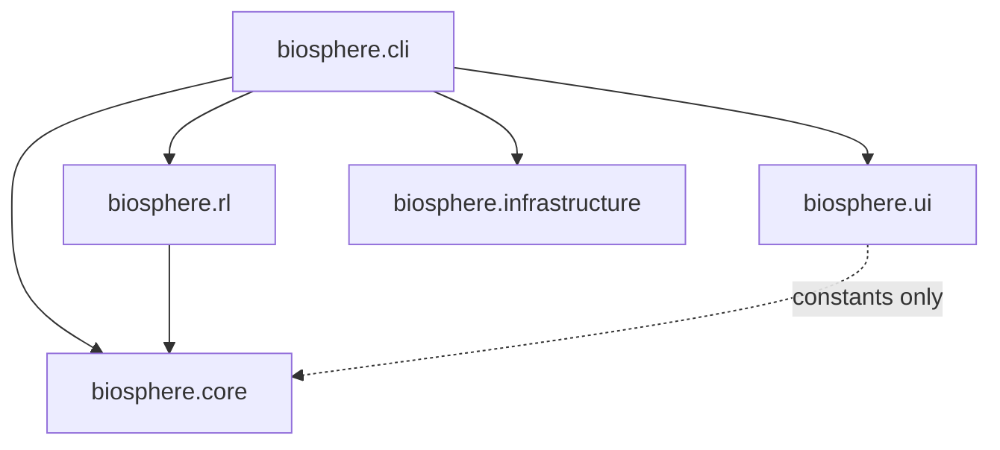

> **BLUF:** Hardened architectural design for the Biosphere Ecological Balancer. Defines five acyclic modules (`core`, `rl`, `ui`, `infrastructure`, `cli`), full interface contracts (GridState, SimulationEngine, BiosphereEnv), action encoding with MaskablePPO integration, and GOV-004/006 compliant error handling. Produced by DarkGravity architect swarm — approved with notes after 3-round adversarial review.

# Biosphere Ecological Balancer — Architecture Specification

> **"Architecture is the art of how to waste space."** — Philip Johnson (adapted: *how to partition responsibility*)

---

## 1. System Decomposition

Five modules with a strict acyclic dependency graph. Cross-module communication occurs *only* through defined interface contracts.

| Module | Responsibility | Dependencies |
|:-------|:--------------|:-------------|
| `biosphere.core` | World state, vectorized ecological/weather rules, domain interventions | **None** (pure Python/NumPy/SciPy) |
| `biosphere.rl` | Gymnasium env wrapper, observation builder, action decoder, reward | `biosphere.core` |
| `biosphere.ui` | Textual TUI dashboard, grid rendering, population charts | `biosphere.core` (constants only) |
| `biosphere.infrastructure` | GOV-004 errors, GOV-006 logging, Pydantic config validation | **None** (leaf dependency) |
| `biosphere.cli` | CLI entry point, dependency wiring, train/run orchestration | All modules |

### 1.1 Dependency Graph



**Key invariants:**
- `biosphere.core` has **zero imports** from any other `biosphere.*` module
- `biosphere.infrastructure` has **zero imports** from any other `biosphere.*` module
- No circular dependencies exist

### 1.2 Runtime Dependency Manifest

| Package | Min Version | Used By | Purpose |
|:--------|:-----------|:--------|:--------|
| `numpy` | 1.24 | `core`, `rl` | Array computation |
| `scipy` | 1.10 | `core` | Gaussian filter, spatial ops |
| `gymnasium` | 0.29 | `rl` | Env protocol |
| `sb3-contrib` | 2.0 | `rl` (training) | MaskablePPO |
| `stable-baselines3` | 2.0 | `rl` (training) | Base RL framework |
| `textual` | 0.40 | `ui` | TUI framework |
| `structlog` | 23.1 | `infrastructure` | Structured logging |
| `pydantic` | 2.0 | `infrastructure` | Config validation |
| `pyyaml` | 6.0 | `infrastructure` | YAML parsing |

---

## 2. Interface Contracts

### 2.1 Core State: `GridState`

Mixed-dtype dictionary of contiguous NumPy arrays. Integer fields use integer dtypes; float fields use `float32`.

```python
# biosphere/core/state.py
GRID_H: int = 50
GRID_W: int = 50
MAX_PER_CELL: int = 8

SPECIES_EMPTY: int = 0
SPECIES_PLANT: int = 1
SPECIES_PREY: int = 2
SPECIES_PREDATOR: int = 3

class GridState(TypedDict):
    terrain: np.ndarray        # (H, W, 3) float32 — elevation, temp, humidity
    species_grid: np.ndarray   # (H, W, 8) uint8  — species IDs per slot
    organism_attrs: np.ndarray # (H, W, 8, 3) float32 — health, energy, age
    resources: np.ndarray      # (H, W, 2) float32 — plant_biomass, water
    weather: np.ndarray        # (H, W, 2) float32 — precipitation, sunlight
```

**Memory per copy:** ~330KB at 50×50. At 30 copies/sec = ~10MB/s (negligible).

### 2.2 Core API: `SimulationEngine`

```python
class SimulationEngine:
    def __init__(self, params: SimulationParams,
                 on_intervention_error: Callable | None = None) -> None: ...
    def step(self, interventions: list[Intervention] | None = None) -> GridState: ...
    def get_state(self) -> GridState: ...  # returns deep copy
    @property
    def tick(self) -> int: ...
```

**Mutability:** Both `get_state()` and `step()` return **deep copies**. Engine retains sole ownership.

**NaN rollback:** Retains one previous state. On NaN detection, restores + dampens energy by 0.9. Two consecutive NaN states → `SimulationError`.

### 2.3 Domain Interventions

Core accepts **domain-level** interventions (not RL-encoded actions):

```python
class InterventionType(IntEnum):
    NO_OP = 0
    SEED_PLANTS = 1
    ADJUST_PRECIPITATION = 2
    CULL_SPECIES = 3

@dataclass(frozen=True)
class Intervention:
    type: InterventionType
    region_row: int     # [0, GRID_H-10]
    region_col: int     # [0, GRID_W-10]
    intensity: float    # [0.0, 1.0]
    target_species: int = SPECIES_EMPTY
```

### 2.4 Configuration Protocol

Core uses structural typing (`Protocol`) — **no Pydantic import** in `biosphere.core`:

```python
@runtime_checkable
class SimulationParams(Protocol):
    growth_rate: float              # (0.0, 1.0]
    reproduction_threshold: float   # (0.0, 1.0]
    max_age_prey: int               # [1, 10_000]
    max_age_predator: int           # [1, 10_000]
    metabolic_rate: float           # (0.0, 1.0]
    weather_sigma: float            # [0.0, 10.0]
```

**Invariant:** `metabolic_rate <= reproduction_threshold` (otherwise reproduction is impossible).

---

## 3. RL Environment: `BiosphereEnv`

### 3.1 Action Encoding

`MultiDiscrete([4, 5, 3, 25])` → 4 dimensions:

| Dim | Size | Meaning |
|:----|:-----|:--------|
| 0 | 4 | Intervention type (NO_OP, SEED, PRECIP, CULL) |
| 1 | 5 | Intensity (0.0, 0.25, 0.5, 0.75, 1.0) |
| 2 | 3 | Target species (prey, predator, unused — always masked) |
| 3 | 25 | Region index (25 non-overlapping 10×10 tiles) |

### 3.2 Action Masks

Single flat `np.ndarray`, shape `(37,)`, dtype `bool` for MaskablePPO:

```
Layout: [type(4) | intensity(5) | species(3) | region(25)]
```

Masking rules:
- Species index 0 (prey): `False` if prey population == 0
- Species index 1 (predator): `False` if predator population == 0
- Species index 2: **always False** (unused slot)
- All other dimensions: always `True`

### 3.3 Observation Space

```python
observation_space = Dict({
    "grid_summary":    Box(shape=(50, 50, 4), dtype=uint8),
    "population_stats": Box(shape=(3, 3), dtype=float32),
    "entropy_history":  Box(shape=(100,), dtype=float32),
    "weather_state":    Box(shape=(4,), dtype=float32),
})
```

### 3.4 Reward Function

| Component | Weight | Formula |
|:----------|:-------|:--------|
| Biodiversity | 1.0 | Shannon entropy of species populations |
| Stability | 0.5 | Negative variance of entropy over window |
| Population health | 0.3 | Mean health of non-empty organisms |
| Terminal penalty | -10.0 | All non-plant species extinct |

Normalization: Running window of 100 steps.

### 3.5 RL Codec API (Static Methods)

Three public static methods form the stable interface for CLI inference:

```python
BiosphereEnv.build_observation(state: GridState, entropy_history: np.ndarray) -> dict
BiosphereEnv.compute_action_masks(state: GridState) -> np.ndarray
BiosphereEnv.decode_action(action: np.ndarray) -> Intervention  # raises ActionDecodingError
```

---

## 4. Error Handling (GOV-004/006 Compliance)

Core does **not** import `structlog`. Uses callback injection:

```python
engine = SimulationEngine(
    params=config,
    on_intervention_error=lambda err: logger.warning(
        "intervention_skipped", error=str(err), error_type=type(err).__name__,
    ),
)
```

| Layer | Exception | Behavior |
|:------|:----------|:---------|
| Core | `SimulationError` | Unrecoverable — two NaN states |
| Core | `InterventionError` | Caught internally, callback invoked, intervention skipped |
| RL | `ActionDecodingError` | Raised by `decode_action()` (inference); silently replaced in `step()` (training) |
| Infra | `ApplicationError` | GOV-004 base; logged as JSONL in `logs/crashes/` |
| Infra | `ConfigurationError` | Invalid YAML config; raised at startup |

---

## 5. Package Export Contract

Every `__init__.py` re-exports submodules by name **and** individual symbols:

```python
# biosphere/core/__init__.py
from biosphere.core import state, simulation, errors
from biosphere.core.state import GridState, Intervention, InterventionType
from biosphere.core.state import GRID_H, GRID_W, MAX_PER_CELL
from biosphere.core.simulation import SimulationEngine
```

Both `from biosphere.core import simulation` and `from biosphere.core import SimulationEngine` must work at every phase.

---

## 6. Scalability Notes

Grid dimensions (`GRID_H=50`, `GRID_W=50`) are **fixed constants** for v1.0. If they change:

1. Update constants in `biosphere.core.state`
2. Recompute RL observation shapes and region map
3. Re-validate performance budget (deep copy cost scales with grid area)
4. Update UI layout dimensions

---

> *"Make the change easy, then make the easy change."* — Kent Beck
