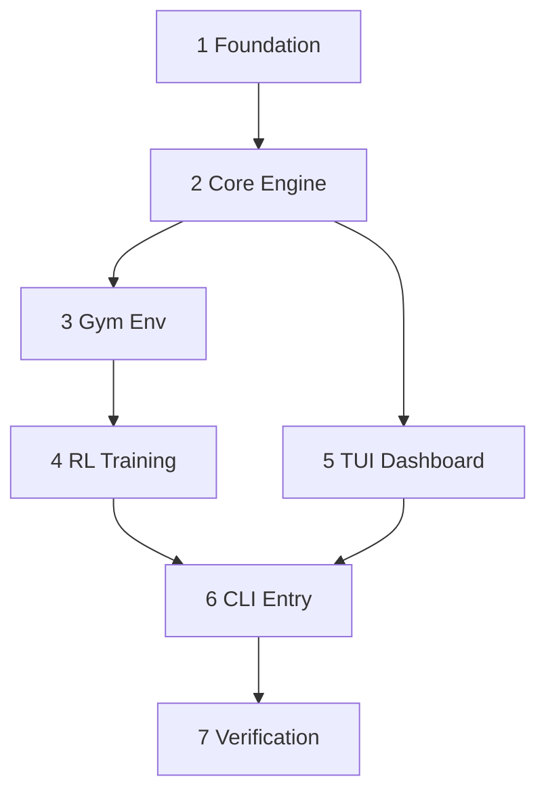

> **BLUF:** Ordered implementation backlog for the Biosphere Ecological Balancer. 7 dependency-ordered tasks from project foundation to final governance audit. Each task includes files to modify, acceptance criteria, and verification commands. Generated by DarkGravity architect pipeline, approved by adversarial swarm review.

# Biosphere Implementation Sprint

> Execute tasks **in order** — each depends on its predecessors.

---

## Prerequisites

- [ ] Python 3.12+ installed
- [ ] Virtual environment created (`python -m venv .venv && source .venv/bin/activate`)
- [ ] BLU-001 and BLU-002 reviewed and understood
- [ ] GOV-001 through GOV-006 governance standards available

---

## Task 1: Project Foundation & Governance Setup

**Goal:** Initialize package structure and GOV-004/006 compliant infrastructure.

| Property | Value |
|:---------|:------|
| **Files** | `biosphere/__init__.py`, `biosphere/errors.py`, `biosphere/logging_config.py`, `requirements.txt` |
| **Branch** | `feat/foundation` |

### Steps

1. Create the directory structure:
   ```
   biosphere/
   ├── core/
   ├── rl/
   ├── ui/
   ├── infrastructure/
   └── cli/
   config/
   tests/
   logs/
   ```

2. Implement `biosphere/infrastructure/errors.py` — `ApplicationError`, `ConfigurationError`
3. Implement `biosphere/infrastructure/logging.py` — `setup_logging()` with JSONL output to `logs/crashes/`
4. Create `requirements.txt` with pinned dependencies (see BLU-002 §1.2)

### Acceptance Criteria

- [ ] `mypy --strict biosphere/` passes with zero errors
- [ ] Raising `ApplicationError` produces JSONL entry in `logs/crashes/`

---

## Task 2: Core Simulation Engine (Vectorized NumPy)

**Goal:** Implement the 2D grid engine with vectorized update cycle.

| Property | Value |
|:---------|:------|
| **Files** | `biosphere/core/simulation.py`, `biosphere/core/state.py`, `biosphere/core/errors.py`, `config/simulation.yaml` |
| **Branch** | `feat/core-engine` |
| **Depends on** | Task 1 |

### Steps

1. Define `GridState` TypedDict and constants in `biosphere/core/state.py` (see BLU-002 §2.1)
2. Define `Intervention` and `InterventionType` in `biosphere/core/state.py` (see BLU-002 §2.3)
3. Implement `SimulationEngine` in `biosphere/core/simulation.py` (see BLU-002 §2.2)
4. Implement `SimulationParams` protocol and parameter validation (see BLU-002 §2.4)
5. Create `config/simulation.yaml` with default parameters

### Acceptance Criteria

- [ ] `pytest-benchmark` shows ≥1000 steps/sec for 50×50 grid
- [ ] Hypothesis property tests confirm energy conservation across 100 steps

---

## Task 3: Gymnasium Environment & Reward Logic

**Goal:** Wrap simulation in Gymnasium-compatible env with multi-objective reward.

| Property | Value |
|:---------|:------|
| **Files** | `biosphere/rl/environment.py`, `biosphere/rl/reward.py` |
| **Branch** | `feat/gym-env` |
| **Depends on** | Task 2 |

### Steps

1. Implement `BiosphereEnv(gym.Env)` with `MultiDiscrete([4, 5, 3, 25])` action space (see BLU-002 §3)
2. Implement observation builder, action decoder, and mask builder as static methods
3. Implement multi-objective reward function (see BLU-002 §3.4)

### Acceptance Criteria

- [ ] `gymnasium.utils.env_checker.check_env()` passes without warnings
- [ ] Reward function returns higher values for higher Shannon entropy states

---

## Task 4: RL Training Pipeline with MaskablePPO

**Goal:** Training script using SB3 + sb3-contrib.

| Property | Value |
|:---------|:------|
| **Files** | `biosphere/rl/train.py`, `config/training.yaml` |
| **Branch** | `feat/rl-training` |
| **Depends on** | Task 3 |

### Steps

1. Implement training loop with `MaskablePPO` from sb3-contrib
2. Handle invalid action masking via `BiosphereEnv.action_masks()`
3. Save checkpoints with correlation IDs per GOV-006

### Acceptance Criteria

- [ ] Training starts and completes 1000 timesteps without errors
- [ ] Agent checkpoints saved to disk with unique correlation ID

---

## Task 5: Textual TUI Dashboard & Grid Rendering

**Goal:** Cross-platform TUI with emoji grid and population charts.

| Property | Value |
|:---------|:------|
| **Files** | `biosphere/ui/app.py`, `biosphere/ui/grid_widget.py`, `biosphere/ui/charts_widget.py` |
| **Branch** | `feat/tui-dashboard` |
| **Depends on** | Task 2 |

### Steps

1. Implement `GridWidget` for emoji/color grid rendering
2. Implement `ChartsWidget` for population dynamics bar charts
3. Implement `BiosphereApp` main Textual application

### Acceptance Criteria

- [ ] TUI displays 50×50 grid at 30 FPS without flicker
- [ ] Population charts update in real-time as simulation steps

---

## Task 6: Integrated CLI & Main Entry Point

**Goal:** Wire everything together with train/run CLI modes.

| Property | Value |
|:---------|:------|
| **Files** | `biosphere/__main__.py` |
| **Branch** | `feat/cli-entrypoint` |
| **Depends on** | Tasks 4, 5 |

### Steps

1. Create `biosphere/__main__.py` with `train` and `run` subcommands
2. Wire dependency injection: config → engine → env → agent → TUI
3. Implement inference loop using RL Codec API (see BLU-002 §3.5)

### Acceptance Criteria

- [ ] `python -m biosphere` opens UI with pre-trained agent
- [ ] Agent actions visible in 'Actions Feed' panel

---

## Task 7: Final Verification & Governance Audit

**Goal:** Full GOV-002 test suite and compliance audit.

| Property | Value |
|:---------|:------|
| **Files** | `tests/conftest.py`, `CODEX/40_VERIFICATION/VER-001_FinalReport.md` |
| **Branch** | `feat/verification` |
| **Depends on** | Task 6 |

### Steps

1. Create test fixtures in `tests/conftest.py`
2. Run full test suite with coverage reporting
3. Run static analysis (Ruff, MyPy)
4. Generate verification report

### Verification

```bash
pytest tests/ -v --tb=short --cov=biosphere --cov-report=term-missing
mypy --strict biosphere/
ruff check biosphere/
```

### Acceptance Criteria

- [ ] `pytest-cov` reports ≥80% line coverage
- [ ] Ruff and MyPy return zero errors for entire codebase

---

## Summary

| Task | Goal | Depends On |
|:-----|:-----|:-----------|
| 1 | Foundation + Governance | — |
| 2 | Core Engine | 1 |
| 3 | Gym Environment | 2 |
| 4 | RL Training | 3 |
| 5 | TUI Dashboard | 2 |
| 6 | CLI Entry Point | 4, 5 |
| 7 | Verification | 6 |



---

> *"Plans are useless, but planning is indispensable."* — Eisenhower
