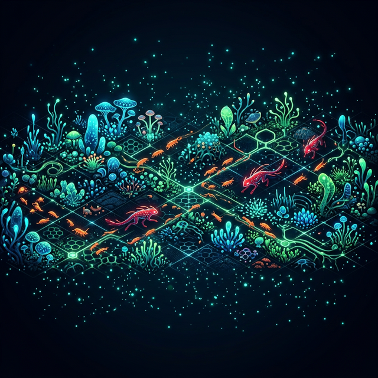
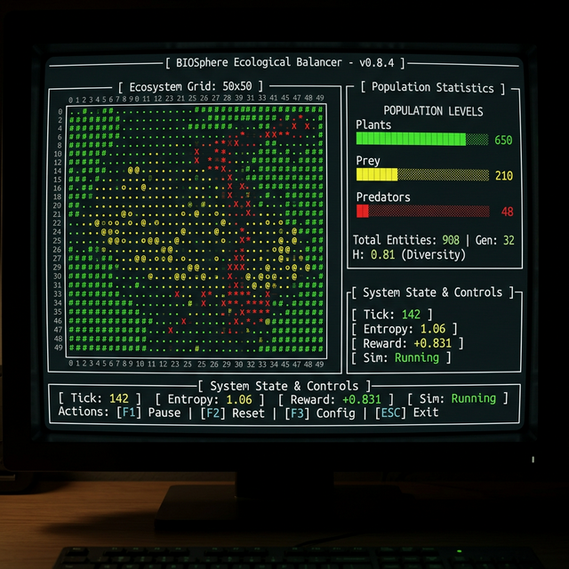
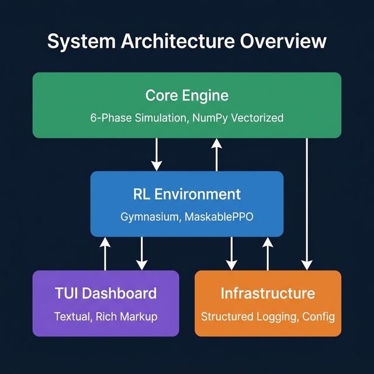

<p align="center">
  
</p>

<h1 align="center">🌿 Biosphere Ecological Balancer</h1>

<p align="center">
  <strong>A real-time 2D world model for RL agent training and biodiversity management</strong>
</p>

<p align="center">
  
  
  
  
  
</p>

---

## What Is This?

Biosphere is a **vectorized ecological simulation** where plants, prey, and predators interact on a 50×50 grid following real ecological models. A **reinforcement learning agent** (MaskablePPO) learns to manage the ecosystem through interventions — seeding plants, adjusting rainfall, and culling species — to maximize biodiversity.

<p align="center">
  
</p>

---

## ✨ Features

| Feature | Details |
|:--------|:--------|
| 🧬 **6-Phase Simulation** | Weather diffusion, logistic resource growth, Lévy flight movement, Holling Type II consumption, sigmoid reproduction, age-based mortality |
| 🤖 **RL Agent** | MaskablePPO via Stable-Baselines3 with action masking for invalid interventions |
| 📊 **Shannon Entropy Reward** | Multi-objective: biodiversity + stability + population health |
| 🖥️ **Terminal Dashboard** | Real-time Textual TUI with grid visualization and population charts |
| ⚡ **Vectorized NumPy** | No Python loops over cells — pure array operations for ~100+ steps/sec |
| 🔒 **NaN Rollback** | Automatic state recovery on numerical instability |
| 📋 **NASA-Grade Governance** | Full CODEX documentation system with 6 governance standards |

---

## 🏗️ Architecture

<p align="center">
  
</p>

```
biosphere/
├── core/           # Simulation engine (NumPy/SciPy, zero external deps)
│   ├── simulation.py    # SimulationEngine — stateful 6-phase orchestrator
│   ├── phases.py        # Weather, growth, movement, consumption, reproduction, mortality
│   └── state.py         # GridState TypedDict, species constants
├── rl/             # Reinforcement learning (Gymnasium + SB3)
│   ├── environment.py   # BiosphereEnv — Dict obs, MultiDiscrete actions, action masks
│   ├── reward.py        # Shannon entropy + stability + health
│   └── train.py         # MaskablePPO training pipeline
├── ui/             # Terminal UI (Textual)
│   ├── app.py           # Main TUI application
│   ├── grid_widget.py   # 50×50 species grid renderer
│   └── charts_widget.py # Population bar charts
└── infrastructure/ # Logging, config, error handling
    ├── logging.py       # structlog JSONL + crash artifacts + correlation IDs
    ├── config.py        # Pydantic-validated SimulationConfig
    └── errors.py        # ApplicationError hierarchy
```

---

## 🚀 Quick Start

### 1. Clone & Install

```bash
git clone https://github.com/BigRigVibeCoder/world_model.git
cd world_model
python3 -m venv .venv
source .venv/bin/activate
pip install -e ".[dev]"
```

### 2. Run Tests

```bash
pytest tests/ -v
# 195 passed ✅
```

### 3. Launch the TUI

```bash
python -m biosphere
```

### 4. Train an RL Agent

```python
from biosphere.rl.train import train
train(total_timesteps=100_000, save_path="checkpoints/my_agent")
```

### 5. Run Headless (No UI)

```python
from biosphere.core.simulation import SimulationEngine
from biosphere.infrastructure.config import SimulationConfig

engine = SimulationEngine(SimulationConfig())
for i in range(100):
    state = engine.step()
    sg = state["species_grid"]
    print(f"Tick {i+1}: {(sg == 1).sum()} plants, {(sg == 2).sum()} prey, {(sg == 3).sum()} predators")
```

---

## 🧪 Testing

195 tests across 7 tiers — **zero mocks in E2E tests**:

| Tier | Count | What It Tests |
|:-----|:------|:-------------|
| Unit | ~100 | Individual functions, pure logic |
| Property-Based | 10+ | Hypothesis-generated edge cases |
| Integration | 15+ | Multi-component interactions |
| Contract | 10+ | API/schema compliance |
| **E2E (Real)** | **23** | **Full stack, no mocks, strong assertions** |
| Performance | 2 | Benchmark throughput (~120 ops/sec) |
| Infrastructure | 8+ | Logging, crash artifacts, config |

### E2E Tests Prove Real Ecosystem Behavior:

- ✅ Predator-prey populations **oscillate** (Lotka-Volterra verified)
- ✅ Resources **deplete** under consumption and **recover** via logistic growth
- ✅ Weather **diffuses** via Gaussian blur
- ✅ Shannon entropy correctly **ranks** biodiversity
- ✅ Interventions cause **measurable** state changes
- ✅ Organisms **die** from starvation, old age, and low health
- ✅ Reproduction **creates** new organisms when energy is high
- ✅ Energy **flows** through the food chain (plants → prey → predators)

```bash
# Run everything
pytest tests/ -v

# Run only E2E tests
pytest tests/e2e/ -v

# Run with coverage
pytest tests/ --cov=biosphere --cov-report=html
```

---

## 📚 Documentation

Full aerospace-grade documentation in `CODEX/`:

| Folder | Contents |
|:-------|:---------|
| `00_INDEX/` | MANIFEST.yaml — machine-readable document registry |
| `10_GOVERNANCE/` | 6 governance standards (coding, testing, logging, errors, docs, agentic dev) |
| `20_BLUEPRINTS/` | Technical specifications (BLU-001, BLU-002) |
| `30_RUNBOOKS/` | User manual, sprint runbooks |
| `40_VERIFICATION/` | Test reports, traceability matrix, coverage HTML |
| `50_DEFECTS/` | Bug reports and gap analyses |

---

## 🔧 Code Quality Tools

```bash
ruff check biosphere/ tests/     # 25 rule categories
mypy --strict biosphere/          # Full type safety
bandit -r biosphere/              # Security scanning
radon cc biosphere/ -a -nc        # Cyclomatic complexity
mutmut run                        # Mutation testing
```

---

## 📖 Ecological Models Used

| Model | Application | Reference |
|:------|:-----------|:----------|
| **Lotka-Volterra** (modified) | Predator-prey dynamics | Lotka (1925), Volterra (1926) |
| **Holling Type II** | Functional response / consumption | Holling (1959) |
| **Shannon-Wiener Index** | Biodiversity entropy measurement | Shannon (1948) |
| **Logistic Growth** | Resource regeneration `dP/dt = rP(1-P/K)` | Verhulst (1838) |
| **Gaussian Diffusion** | Weather pattern spreading | — |
| **Sigmoid Reproduction** | Energy-dependent reproduction `p = 1/(1+exp(-k(E-θ)))` | — |

---

## 📄 License

MIT

---

<p align="center">
  <em>Built with the <a href="CODEX/10_GOVERNANCE/">Agentic Architect</a> methodology — an AI-human collaborative development framework.</em>
</p>
